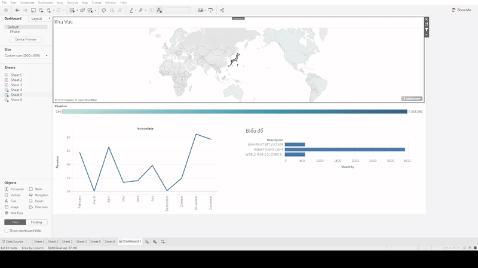

# Phân tích Hành vi Khách hàng & Dự đoán Churn cho Doanh nghiệp Bán lẻ

Dự án này thực hiện một quy trình phân tích dữ liệu end-to-end, từ việc xây dựng pipeline ETL tự động đến huấn luyện mô hình Machine Learning, nhằm tìm ra insight giá trị và dự đoán hành vi rời bỏ của khách hàng.

---

### 📊 Dashboard Tương tác

Dưới đây là bản demo tương tác của dashboard. Để trải nghiệm đầy đủ, bạn có thể mở file `dashboard/retail_analysis.twbx` bằng Tableau.




---

### 🚀 Kiến trúc & Luồng dữ liệu

Dự án được xây dựng theo kiến trúc hiện đại, đảm bảo tính tự động và tái lập.

`Dữ liệu thô (.csv) -> Docker Compose (Python ETL) -> MySQL Database -> Phân tích (Jupyter) & Trực quan hóa (Tableau)`

---

### 🛠️ Công nghệ sử dụng

- **Ngôn ngữ:** Python 3.9
- **Thư viện Python:** Pandas, Scikit-learn, SQLAlchemy, Joblib
- **Database:** MySQL 8.0
- **Containerization:** Docker, Docker Compose
- **Trực quan hóa:** Tableau Public, Matplotlib, Seaborn
- **CI/CD:** GitHub Actions (Linting with Flake8)
- **IDE:** VS Code, Jupyter Notebook

---

### 🏁 Hướng dẫn cài đặt & Chạy dự án (Quickstart)

Chỉ cần có Docker và Docker Compose là bạn có thể chạy toàn bộ pipeline.

1.  **Clone repository:**
    ```bash
    git clone [https://github.com/Duy75973/retail-analytics-project.git](https://github.com/Duy75973/retail-analytics-project.git)
    cd your-repo-name
    ```

2.  **Thiết lập biến môi trường:**
    Sao chép file `.env.example` thành `.env` và điền mật khẩu MySQL của bạn.
    ```bash
    cp .env.example .env
    ```

3.  **Khởi chạy toàn bộ pipeline:**
    Lệnh này sẽ khởi tạo database MySQL, sau đó chạy script ETL để xử lý và nạp dữ liệu.
    ```bash
    docker-compose up --build
    ```
    Sau khi chạy xong, dữ liệu sạch sẽ sẵn sàng trong database MySQL.

---

### 📂 Cấu trúc thư mục

- **`.github/workflows/`**: Chứa file cấu hình CI của GitHub Actions.
- **`data/`**: Chứa dữ liệu thô và dữ liệu đã được xử lý.
- **`dashboard/`**: Chứa file workbook (`.twbx`) của Tableau.
- **`models/`**: Chứa model đã được huấn luyện (`.joblib`).
- **`notebooks/`**: Chứa các file Jupyter Notebook cho EDA, Feature Engineering và Model Training.
- **`src/`**: Chứa script ETL chính bằng Python.
- **`sql/`**: Chứa file định nghĩa schema cho database.

---

### 📈 Kết quả chính & Insights

1.  **Phân tích EDA:** Doanh thu có xu hướng tăng đột biến vào Quý 4 hàng năm. Thị trường Vương quốc Anh chiếm trên 85% tổng doanh thu.
2.  **Phân khúc khách hàng:** Xây dựng thành công mô hình RFM để phân loại khách hàng thành các nhóm như "Champions", "Loyal Customers", "At-Risk".
3.  **Dự đoán Churn:** Mô hình `RandomForestClassifier` đạt **ROC AUC ~0.95**, có khả năng dự báo chính xác các khách hàng có nguy cơ rời bỏ cao trong 90 ngày tới.

---

### 🔜 Hướng phát triển tiếp theo

-   Triển khai mô hình dự đoán thành một API service.
-   Sử dụng một công cụ điều phối (orchestration) như Airflow hoặc Prefect để lên lịch chạy pipeline ETL định kỳ.
-   Thử nghiệm các thuật toán khác và tối ưu hóa tham số cho mô hình.